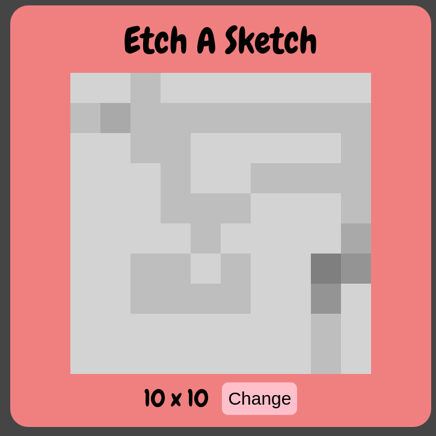

# Etch A Sketch Project

## Introduction

This is an Etch A Sketch simulation web page, which was done as a project from [The Odin Project](https://www.theodinproject.com/lessons/foundations-etch-a-sketch).

## Instructions

This project can be accessed from [Etch A Sketch](https://mike-c2.github.io/odin-etch-a-sketch-two).

Just simply hover the mouse over the gray box in the middle of the Etch A Sketch and it will darken the little box areas.  It's set to 10 x 10 by default, but this can be changed by clicking on the Change button.  A new number can be entered here, which must be within the range of 1 <= N <= 100.